<div align="center">
  <a href="https://github.com/brokermr810/QuantDinger">
    
  </a>

  <h1>QuantDinger</h1>

  <h3>AI原生量化交易平台</h3>
  <p><strong>Vibe Coding 遇见算法交易</strong></p>

  <p>
  <a href="README.md"><strong>🇺🇸 English</strong></a> &nbsp;·&nbsp;
  <a href="docs/README_CN.md"><strong>🇨🇳 中文</strong></a> &nbsp;·&nbsp;
  <a href="https://ai.quantdinger.com"><strong>🌐 在线演示</strong></a> &nbsp;·&nbsp;
  <a href="https://youtu.be/HPTVpqL7knM"><strong>📺 视频</strong></a> &nbsp;·&nbsp;
  <a href="https://www.quantdinger.com"><strong>💬 社区</strong></a> &nbsp;·&nbsp;
  <a href="#-快速开始-2分钟"><strong>🚀 快速开始</strong></a>
  </p>

  <p>
    <strong>7个AI智能体 · Python策略 · 10+交易所 · 预测市场 · 您的服务器，您的密钥</strong>
  </p>
  <p>
    <i>用自然语言描述您的交易想法 → AI编写Python策略 → 回测 → 实盘交易。<br/>
    无需编程。自托管 — 您的API密钥和策略永远不会离开您的机器。</i>
  </p>

  <p>
    <a href="LICENSE"></a>
    
    
    
    
    
  </p>

  <p>
    <a href="https://t.me/quantdinger"></a>
    <a href="https://discord.com/invite/tyx5B6TChr"></a>
    <a href="https://x.com/quantdinger_en"></a>
  </p>

  <sub>🇺🇸 English · 🇨🇳 简体中文 · 🇹🇼 繁體中文 · 🇯🇵 日本語 · 🇰🇷 한국어 · 🇩🇪 Deutsch · 🇫🇷 Français · 🇹🇭 ไทย · 🇻🇳 Tiếng Việt · 🇸🇦 العربية</sub>
</div>

---

## 📑 目录

- [🚀 快速开始（2分钟）](#-快速开始-2分钟)
- [🎯 为什么选择QuantDinger？](#-为什么选择quantdinger)
- [📸 视觉导览](#-视觉导览--观看视频演示)
- [✨ 核心功能](#-核心功能)
- [🔗 QuantDinger 交易所注册邀请链接](#quantdinger-交易所注册邀请链接)
- [🔌 支持的交易所和经纪商](#-支持的交易所和经纪商)
- [🏗️ 架构与配置](#️-架构与配置)
- [📚 文档索引](#-文档索引)
- [💼 许可与商业](#-许可与商业)
- [🤝 社区与支持](#-社区与支持)

---

## 🚀 快速开始（2分钟）

> **只需**：安装 [Docker](https://docs.docker.com/get-docker/)。无需其他。

```bash
# 1. 克隆
git clone https://github.com/brokermr810/QuantDinger.git
cd QuantDinger

# 2. 复制后端配置
cp backend_api_python/env.example backend_api_python/.env

# 3. 生成并写入安全的 SECRET_KEY
./scripts/generate-secret-key.sh

# 4. 启动！
docker-compose up -d --build
```

> **Linux/macOS**:
> - 复制后端配置：
>   `cp backend_api_python/env.example backend_api_python/.env`
> - 如果需要更多高级配置，直接查看这个文件下半部分的 “Advanced / rarely changed”：
>   `backend_api_python/env.example`
> - 可选：如果你所在网络拉取 Docker Hub 较慢或不可达，再复制项目根镜像配置：
>   `cp .env.example .env`
> - 生成并写入 `SECRET_KEY`：
>   `./scripts/generate-secret-key.sh`
> - 启动：
>   `docker-compose up -d --build`

> **Windows PowerShell**: 
> - 复制后端配置：
>   `Copy-Item backend_api_python\env.example -Destination backend_api_python\.env`
> - 如果需要更多高级配置，直接查看这个文件下半部分的 “Advanced / rarely changed”：
>   `backend_api_python\env.example`
> - 可选：如果你所在网络拉取 Docker Hub 较慢或不可达，再复制项目根镜像配置：
>   `Copy-Item .env.example -Destination .env`
> - 生成并写入 `SECRET_KEY`：
>   `$key = py -c "import secrets; print(secrets.token_hex(32))"`
>   `(Get-Content backend_api_python\.env) -replace '^SECRET_KEY=.*$', "SECRET_KEY=$key" | Set-Content backend_api_python\.env -Encoding UTF8`
> - 启动：
>   `docker-compose up -d --build`

> **⚠️ 安全提示**：如果 `SECRET_KEY` 使用默认值，容器将**不会启动**。这可以防止不安全的部署。

🎉 **完成！** 打开 **http://localhost:8888** | 登录：`quantdinger` / `123456`

<details>
<summary><b>📝 backend_api_python/.env 中的关键设置</b></summary>

```ini
# 必需 — 生产环境请修改！
ADMIN_USER=quantdinger
ADMIN_PASSWORD=your_secure_password
SECRET_KEY=your_random_secret_key  # ⚠️ 必须修改！生成方式：python3 -c "import secrets; print(secrets.token_hex(32))"

# 可选 — 启用AI功能（选择一个）
OPENROUTER_API_KEY=your_key        # 推荐：100+模型
OPENAI_API_KEY=your_key            # GPT-4o
DEEPSEEK_API_KEY=your_key          # 性价比高
GOOGLE_GEMINI_API_KEY=your_key     # Gemini
```

</details>

<details>
<summary><b>🔐 生成 SECRET_KEY（Docker部署必需）</b></summary>

**在启动Docker之前，您必须设置一个安全的 SECRET_KEY：**

```bash
# 方式1：使用辅助脚本（Linux/Mac）
./scripts/generate-secret-key.sh

# 方式2：使用辅助脚本（Windows PowerShell）
.\scripts\generate-secret-key.ps1

# 方式3：手动生成
python3 -c "import secrets; print(secrets.token_hex(32))"
# 然后编辑 backend_api_python/.env 并替换 SECRET_KEY 值
```

**⚠️ 如果 SECRET_KEY 使用默认值，容器将不会启动！**

</details>

<details>
<summary><b>🔧 常用Docker命令</b></summary>

```bash
docker-compose ps                  # 查看服务状态
docker-compose logs -f backend     # 查看后端日志（实时）
docker-compose restart backend     # 仅重启后端
docker-compose up -d --build       # 重建并重启所有服务
docker-compose down                # 停止所有服务
```

**更新到最新版本：**
```bash
git pull && docker-compose up -d --build
```

**备份和恢复数据库：**
```bash
docker exec quantdinger-db pg_dump -U quantdinger quantdinger > backup.sql
cat backup.sql | docker exec -i quantdinger-db psql -U quantdinger quantdinger
```

**自定义端口** — 在项目根目录创建 `.env`：
```ini
FRONTEND_PORT=3000          # 默认：8888
BACKEND_PORT=127.0.0.1:5001 # 默认：5000
```

**可选镜像源** — 默认直连 Docker Hub。如果你所在地区/网络无法拉取基础镜像，可复制 `.env.example` 为 `.env`，只改一行：
```ini
IMAGE_PREFIX=docker.m.daocloud.io/library/
```

其他常见选择：
```ini
IMAGE_PREFIX=
IMAGE_PREFIX=docker.xuanyuan.me/library/
```

**Docker 常见问题**
```text
1. 镜像源切换由项目根目录 `.env` 控制，不是 `backend_api_python/.env`。
2. 当前开源仓库已内置 `frontend/dist`，前端部署不再依赖 Node.js。
3. Windows 下如果后端日志出现：
   exec /usr/local/bin/docker-entrypoint.sh: no such file or directory
   通常是镜像层里的 shell/换行符兼容性问题。可执行：
   docker-compose build --no-cache backend
4. 如果前端日志出现：
   host not found in upstream "backend"
   一般是后端先启动失败导致的连锁报错。先修复后端，再执行：
   docker-compose restart frontend
5. 如果前端构建报错：
   COPY frontend/dist ... not found
   请检查 `.dockerignore`，确认没有把 `frontend/dist` 排除在 Docker 构建上下文之外。
6. 如果后台配置页点击保存时报错：
   Read-only file system: '/app/.env'
   请检查 `docker-compose.yml`，确认 `backend_api_python/.env` 不是以只读方式挂载。
7. Docker 部署下如果需要走本机代理，不要使用 `127.0.0.1`，应改为 `host.docker.internal`。
   例如：
   PROXY_URL=socks5h://host.docker.internal:10808
8. 如果代理修复后仍出现某些交易对 "not found" 日志，通常是交易所符号映射问题
   （例如代币更名），不一定是网络故障。
```

</details>

---

## 🎯 为什么选择QuantDinger？

> **Vibe Coding交易** — 用纯英文（或任何语言）描述您的交易想法。AI编写Python策略，回测它，并将其部署到实盘市场。无需手动编码。无SaaS锁定。一切都在您自己的服务器上运行。

| | |
|---|---|
| 🎵 **Vibe Coding** | 用自然语言描述想法 → AI生成生产就绪的Python策略 |
| 🔒 **100%自托管** | API密钥和策略永远不会离开您的服务器 — 隐私设计 |
| 🤖 **7个AI智能体** | 多智能体研究团队：并行分析 → 辩论 → 交易决策 |
| 🐍 **Python原生** | 完整生态系统（Pandas、NumPy、TA-Lib、scikit-learn）— 无专有语言限制 |
| 📊 **专业图表** | 带Python指标 K线图，实时可视化 |
| 🌍 **加密货币+股票+外汇** | 10+交易所、IBKR、MT5 — 一体化平台 |
| 📊 **预测市场** | Polymarket按需AI分析 — 概率差异、机会评分 |
| 💰 **变现就绪** | 会员、积分、USDT链上支付 — 内置 |
| ⚡ **2分钟部署** | `docker-compose up -d` — 生产就绪，零构建 |

---


## ✨ 核心功能

### 🎵 Vibe Coding策略工作台

> **无需编程。** 用自然语言告诉AI您想要什么 — 它生成生产就绪的Python策略。或者使用完整的Python生态系统（Pandas、NumPy、TA-Lib、scikit-learn）编写您自己的策略。在专业K线图上可视化一切。

```
💬 "我想要一个MACD交叉策略，在BTC 15分钟图上使用RSI过滤器"
    ↓ AI生成Python代码
    ↓ 📈 在K线图上可视化
    ↓ 🔄 使用丰富指标回测
    ↓ 🤖 AI建议优化
    ↓ 🚀 一键部署到实盘交易
```

### 🤖 7智能体AI分析引擎

> 不仅仅是一次AI调用。QuantDinger部署了**7个专业智能体**，它们像研究团队一样协作 — 分析、辩论并达成共识：

```
阶段1（并行）：  📊 技术 · 📑 基本面 · 📰 新闻 · 💭 情绪 · ⚠️ 风险
阶段2（辩论）：  🐂 多头 vs 🐻 空头 — 结构化论证
阶段3（决策）：  🎯 交易智能体 → 买入 / 卖出 / 持有（带置信度%）
```

- **🎵 自然语言分析** — 询问"分析BTC下周趋势" → 7个智能体提供完整报告
- **📡 AI交易雷达** — 每小时自动扫描加密货币/股票/外汇，发现机会
- **⚡ 快速交易面板** — 看到信号？一键执行。无需切换页面。
- **🧠 记忆增强** — 智能体从过去的分析中学习（本地RAG，非云端）
- **🔌 5+ LLM提供商**：OpenRouter（100+模型）、OpenAI、Gemini、DeepSeek、Grok
- **📊 Polymarket预测市场** — 预测市场按需AI分析。输入市场链接或标题 → AI分析概率差异、机会评分和交易建议。完整历史跟踪和计费集成。
- **📋 虚拟持仓管理** — 自选股中直接创建虚拟持仓，支持做多/做空方向、数量、买入单价，实时计算盈亏。无需连接真实交易所即可跟踪模拟投资组合。

### 📈 完整交易生命周期

| 步骤 | 发生什么 |
|------|-------------|
| **1. 💬 描述** | 用自然语言告诉AI您的交易想法 — 或直接编写Python |
| **2. 🤖 生成** | AI为您创建指标和策略代码 |
| **3. 📊 可视化** | 在专业K线图上即时查看信号 |
| **4. 🔄 回测** | 丰富指标 + **AI分析结果并建议改进** |
| **5. 🚀 执行** | 在10+加密货币交易所、IBKR（股票）、MT5（外汇）实盘交易 |
| **6. 📡 监控** | 投资组合跟踪器，通过Telegram/Discord/Email/SMS/Webhook提醒 |

### 📊 Polymarket预测市场分析

> **预测市场按需AI分析。** 输入Polymarket链接或市场标题 → AI分析概率差异、机会评分并提供交易建议。

**功能：**
- **🔍 智能搜索** — 支持市场链接、slug或自然语言标题
- **🤖 AI概率预测** — 比较AI预测概率与市场概率
- **📈 机会评分** — 基于差异和置信度计算机会评分
- **💡 交易建议** — YES/NO/HOLD，带详细推理和关键因素
- **📚 历史跟踪** — 在专用历史标签页中查看所有过去的分析
- **💰 计费集成** — 每次分析可配置积分消耗（通过`BILLING_COST_POLYMARKET_DEEP_ANALYSIS`设置）
- **🌍 多语言** — AI响应匹配您的前端语言（英文/中文）
- **📊 管理员统计** — 所有分析在用户管理仪表板中跟踪

**使用方法：**
```
1. 导航到AI资产分析 → 预测市场标签
2. 输入Polymarket链接或市场标题
3. AI分析并返回：
   - 市场概率 vs AI预测概率
   - 差异分析
   - 机会评分（0-100）
   - 交易建议（YES/NO/HOLD）
   - 详细推理和关键因素
4. 随时查看分析历史
```

### 💰 内置变现

> 大多数开源项目需要数月的自定义计费工作。QuantDinger开箱即用，提供**完整的变现系统**：

- **💳 会员计划** — 月度/年度/终身层级，可配置定价和积分
- **₿ USDT链上支付** — TRC20扫码支付，每订单地址的HD钱包（xpub），通过TronGrid自动对账
- **🏪 指标市场** — 用户发布和销售Python指标，您收取佣金
- **⚙️ 管理员仪表板** — 订单管理、AI使用统计、用户分析；系统设置保存后热重载，无需重启服务

### 🔐 企业级安全

- **多用户** — 基于PostgreSQL的账户，带基于角色的权限
- **OAuth** — Google和GitHub一键登录
- **保护** — Cloudflare Turnstile、IP/账户速率限制、邮箱验证
- **演示模式** — 公共展示的只读模式

<details>
<summary><b>🧠 AI 分析架构图（点击展开）</b></summary>

当前采用 **FastAnalysisService** 单次 LLM 流程，兼顾速度与多因子决策：

```mermaid
flowchart TB
    subgraph Entry["🌐 API 入口"]
        A["📡 POST /api/fast-analysis/analyze"]
        A2["📜 GET /api/fast-analysis/history"]
        A3["📊 GET /api/fast-analysis/similar-patterns"]
    end
    subgraph Data["📊 数据采集层"]
        D1[MarketDataCollector]
        D2["价格 · K线 · 宏观 · 新闻 · 基本面"]
        D3["多周期共识 1D / 4H / 1H"]
    end
    subgraph Analysis["⚙️ 分析层"]
        B["FastAnalysisService"]
        C["单次 LLM 调用<br/>强约束 Prompt"]
        E["客观评分 + 多周期共识"]
        F["AICalibration 阈值校准"]
        G["买入 / 卖出 / 持有"]
    end
    subgraph Memory["🧠 记忆层"]
        M1[("qd_analysis_memory<br/>PostgreSQL")]
        M2["RAG 相似模式检索<br/>（可选注入 Prompt）"]
    end
    A --> B
    B --> D1 --> D2 --> D3
    D3 --> C --> E --> F --> G
    B -.->|"存储"| M1
    M1 -.->|"相似模式"| M2
    M2 -.->|"可选上下文"| C
    A2 --> M1
    A3 --> M1
```



**流程概要：**
1. **数据采集** — 统一 `MarketDataCollector` 拉取价格、K 线、宏观、新闻、基本面
2. **多周期共识** — 主周期 + 4H/1D 等技术周期，计算加权客观评分
3. **单次 LLM** — 强约束 Prompt，综合技术 / 宏观 / 新闻 / 基本面
4. **共识校准** — 当客观评分显著时，可覆盖 LLM 决策；数据质量差时倾向 HOLD
5. **记忆存储** — 写入 `qd_analysis_memory`，支持历史查询与相似模式检索

<details>
<summary><b>📈 AI 分析优化（已实现）</b></summary>

| 功能 | 说明 | 配置 |
|------|------|------|
| **RAG 记忆注入** | 相似历史模式注入 Prompt | 默认启用 |
| **多指标相似度** | RSI、MACD、MA 趋势、波动率加权相似度 | 默认启用 |
| **反思验证** | 验证历史决策，更新 `was_correct` | `ENABLE_REFLECTION_WORKER=true` |
| **阈值自校准** | 定期校准 BUY/SELL 阈值 | `scripts/run_calibration.py` 或 `scripts/run_reflection_task.py` |
| **置信度校准** | 按置信度分桶统计准确率并调整 | `ENABLE_CONFIDENCE_CALIBRATION=true` |
| **市场状态感知** | 趋势/震荡市使用不同阈值（震荡市更保守） | 默认启用 |
| **多模型投票** | 2–3 模型投票降低单点偏差 | `ENABLE_AI_ENSEMBLE=true` + `AI_ENSEMBLE_MODELS=model1,model2` |

详见 `backend_api_python/env.example` 中的 AI analysis optimizations 部分。

</details>

</details>

---

## 🔗 QuantDinger 交易所注册邀请链接

以下为 **QuantDinger** 合作邀请注册链接。通过链接开户可能享受交易手续费返佣（例如最高约 **20%** 返佣，具体以各交易所规则与活动为准）。

| 交易所 | 邀请 / 注册链接 |
|--------|-----------------|
| Binance | [注册开户](https://www.bsmkweb.cc/register?ref=QUANTDINGER) |
| Bitget | [注册开户](https://partner.hdmune.cn/bg/7r4xz8kd) |
| Bybit | [注册开户](https://partner.bybit.com/b/DINGER) |
| OKX | [注册开户](https://www.xqmnobxky.com/join/QUANTDINGER) |
| Gate.io | [注册开户](https://www.gateport.company/share/DINGER) |
| HTX | [注册开户](https://www.htx.com/invite/zh-cn/1f?invite_code=dinger) |

网页端登录后，亦可在 **个人中心 → 选择交易所开户** 使用相同链接。

---

## 🔌 支持的交易所和经纪商

### 加密货币（直接API交易）

| 交易所 | 市场 |
|:--------:|:---------|
| Binance | 现货、期货、杠杆 |
| OKX | 现货、永续、期权 |
| Bitget | 现货、期货、跟单交易 |
| Bybit | 现货、线性期货 |
| Coinbase | 现货 |
| Kraken | 现货、期货 |
| KuCoin | 现货、期货 |
| Gate.io | 现货、期货 |
| Bitfinex | 现货、衍生品 |

### 传统经纪商和市场

| 市场 | 经纪商/数据源 | 交易 |
|--------|--------------|---------|
| **美股** | Interactive Brokers (IBKR)、Yahoo Finance、Finnhub | ✅ 通过IBKR |
| **外汇** | MetaTrader 5 (MT5)、OANDA | ✅ 通过MT5 |
| **期货** | 交易所API | ⚡ 数据 + 通知 |

### 交易所返佣入口

完整列表见上文：[QuantDinger 交易所注册邀请链接](#quantdinger-交易所注册邀请链接)。

---

## 🏗️ 架构与配置

### 技术栈

| 层级 | 技术 |
|-------|-----------|
| **AI引擎** | 7智能体多智能体系统 · RAG记忆 · 5+ LLM提供商 · Vibe Coding（自然语言→Python） |
| **后端** | Python 3.10+ · Flask · PostgreSQL 16 · Redis（可选） |
| **前端** | Vue.js · Ant Design · KlineCharts · ECharts |
| **支付** | USDT TRC20链上 · HD钱包（BIP-32/44） · TronGrid API |
| **移动端** | Vue 3 + Capacitor（Android / iOS） |
| **部署** | Docker Compose · Nginx · 零构建一键部署 |

```text
┌─────────────────────────────────────┐
│         Docker Compose              │
│                                     │
│  ┌───────────────────────────────┐  │
│  │  frontend (Nginx)  → :8888   │  │
│  └──────────────┬────────────────┘  │
│                 │ /api/* 代理       │
│  ┌──────────────▼────────────────┐  │
│  │  backend (Flask)   → :5000   │  │
│  └──────────────┬────────────────┘  │
│  ┌──────────────▼────────────────┐  │
│  │  postgres (PG 16)  → :5432   │  │
│  └───────────────────────────────┘  │
│                                     │
│  外部：LLM API · 交易所 ·           │
│  TronGrid · 数据提供商              │
└─────────────────────────────────────┘
```

### 仓库结构

```text
QuantDinger/
├── backend_api_python/          # 🐍 后端（开源，Apache 2.0）
│   ├── app/routes/              #   API端点
│   ├── app/services/            #   业务逻辑（AI、交易、支付）
│   ├── migrations/init.sql      #   数据库架构
│   ├── env.example              #   ⚙️ 配置模板 → 复制到.env
│   └── Dockerfile
├── frontend/                    # 🎨 前端（预构建）
│   ├── dist/                    #   静态文件（HTML/JS/CSS）
│   ├── Dockerfile               #   Nginx镜像
│   └── nginx.conf               #   SPA路由 + API代理
├── docs/                        # 📚 指南和教程
├── docker-compose.yml           # 🐳 一键部署
└── LICENSE                      # Apache 2.0
```

<details>
<summary><b>⚙️ 配置参考（.env）</b></summary>

使用 `backend_api_python/env.example` 作为精简模板。
文件上半部分适合首次部署，下面的 “Advanced / rarely changed” 区域用于可选的高级调优。

| 类别 | 关键变量 |
|----------|-----------|
| **认证** | `SECRET_KEY`、`ADMIN_USER`、`ADMIN_PASSWORD` |
| **数据库** | `DATABASE_URL`（PostgreSQL连接字符串） |
| **AI / LLM** | `LLM_PROVIDER`、`OPENROUTER_API_KEY`、`OPENAI_API_KEY` |
| **OAuth** | `GOOGLE_CLIENT_ID`、`GITHUB_CLIENT_ID` |
| **安全** | `TURNSTILE_SITE_KEY`、`ENABLE_REGISTRATION` |
| **计费** | `BILLING_ENABLED`、`BILLING_COST_AI_ANALYSIS`、`BILLING_COST_AI_CODE_GEN` |
| **会员** | `MEMBERSHIP_MONTHLY_PRICE_USD`、`MEMBERSHIP_MONTHLY_CREDITS` |
| **USDT支付** | `USDT_PAY_ENABLED`、`USDT_TRC20_XPUB`、`TRONGRID_API_KEY` |
| **代理** | `PROXY_URL` |
| **工作器** | `ENABLE_PENDING_ORDER_WORKER`、`ENABLE_PORTFOLIO_MONITOR`、`ENABLE_REFLECTION_WORKER` |
| **AI调优** | `ENABLE_AI_ENSEMBLE`、`ENABLE_CONFIDENCE_CALIBRATION`、`AI_ENSEMBLE_MODELS` |

</details>

<details>
<summary><b>🔌 API端点</b></summary>

| 端点 | 描述 |
|----------|-------------|
| `GET /api/health` | 健康检查 |
| `POST /api/user/login` | 用户认证 |
| `GET /api/user/info` | 当前用户信息 |
| `GET /api/billing/plans` | 会员计划 |
| `POST /api/billing/usdt/create-order` | 创建USDT支付订单 |

完整路由列表，请参见 `backend_api_python/app/routes/`。

</details>

---

## 📚 文档索引

所有详细指南都在 [`docs/`](docs/) 文件夹中：

### 入门指南

| 文档 | 描述 |
|----------|-------------|
| [更新日志](docs/CHANGELOG.md) | 版本历史和迁移说明 |
| [多用户设置](docs/multi-user-setup.md) | PostgreSQL多用户部署 |
| [云服务器部署](docs/CLOUD_DEPLOYMENT_CN.md) | 云服务器部署、域名、HTTPS 与反向代理 |

### 策略开发

| 指南 | 🇺🇸 EN | 🇨🇳 CN | 🇹🇼 TW | 🇯🇵 JA | 🇰🇷 KO |
|-------|--------|--------|--------|--------|--------|
| **策略开发** | [EN](docs/STRATEGY_DEV_GUIDE.md) | [CN](docs/STRATEGY_DEV_GUIDE_CN.md) | [TW](docs/STRATEGY_DEV_GUIDE_TW.md) | [JA](docs/STRATEGY_DEV_GUIDE_JA.md) | [KO](docs/STRATEGY_DEV_GUIDE_KO.md) |
| **跨品种** | [EN](docs/CROSS_SECTIONAL_STRATEGY_GUIDE_EN.md) | [CN](docs/CROSS_SECTIONAL_STRATEGY_GUIDE_CN.md) | | | |
| **代码示例** | [examples/](docs/examples/) | | | | |

### 经纪商和集成

| 指南 | English | 中文 |
|-------|---------|------|
| **IBKR（美股）** | [指南](docs/IBKR_TRADING_GUIDE_EN.md) | — |
| **MT5（外汇）** | [指南](docs/MT5_TRADING_GUIDE_EN.md) | [指南](docs/MT5_TRADING_GUIDE_CN.md) |
| **OAuth（Google/GitHub）** | [指南](docs/OAUTH_CONFIG_EN.md) | [指南](docs/OAUTH_CONFIG_CN.md) |

### 通知

| 渠道 | English | 中文 |
|---------|---------|------|
| **Telegram** | [设置](docs/NOTIFICATION_TELEGRAM_CONFIG_EN.md) | [配置](docs/NOTIFICATION_TELEGRAM_CONFIG_CH.md) |
| **Email（SMTP）** | [设置](docs/NOTIFICATION_EMAIL_CONFIG_EN.md) | [配置](docs/NOTIFICATION_EMAIL_CONFIG_CH.md) |
| **SMS（Twilio）** | [设置](docs/NOTIFICATION_SMS_CONFIG_EN.md) | [配置](docs/NOTIFICATION_SMS_CONFIG_CH.md) |

---

## 💼 许可与商业

### 开源许可

后端源代码根据 **Apache License 2.0** 许可。参见 `LICENSE`。

前端UI作为**预构建文件**提供。商标权（名称/徽标/品牌）单独管理 — 参见 `TRADEMARKS.md`。

### 🎓 非营利和教育免费源代码

如果您是**大学**、**研究机构**、**非营利组织**、**社区团体**或**教育项目**，可以申请**免费授权和完整前端源代码**：

- 🏫 大学和学术研究
- 🌍 开源社区和开发者团体
- 🤝 非营利和公益组织
- 📚 教育项目和学生黑客马拉松

### 💼 商业许可

对于**商业用途**，购买许可可获得：

- **完整前端源代码** + 未来更新
- **品牌授权** — 按约定修改名称/徽标/版权
- **运营支持** — 部署、升级、事件响应
- **咨询** — 架构审查、性能调优

### 📬 联系方式

| 渠道 | 链接 |
|---------|---------|
| **Telegram** | [t.me/worldinbroker](https://t.me/worldinbroker) |
| **Email** | [brokermr810@gmail.com](mailto:brokermr810@gmail.com) |

---

## 🤝 社区与支持

<p>
  <a href="https://t.me/quantdinger"></a>
  <a href="https://discord.com/invite/tyx5B6TChr"></a>
  <a href="https://youtube.com/@quantdinger"></a>
</p>

- [贡献指南](CONTRIBUTING.md) · [贡献者](CONTRIBUTORS.md)
- [报告Bug / 请求功能](https://github.com/brokermr810/QuantDinger/issues)
- 邮箱：[brokermr810@gmail.com](mailto:brokermr810@gmail.com)

---

### 💝 支持项目

**加密货币捐赠（ERC-20 / BEP-20 / Polygon / Arbitrum）**

```
0x96fa4962181bea077f8c7240efe46afbe73641a7
```

<p>
  
  
</p>

---

### 🎓 支持合作伙伴

<div align="center">
<table>
  <tr>
    <td align="center" width="50%">
      <a href="https://beinvolved.indiana.edu/organization/quantfiniu" target="_blank">
        
      </a>
      <br/><br/>
      <strong>Quantitative Finance Society (QFS)</strong><br/>
      <small>Indiana University Bloomington</small>
    </td>
  </tr>
</table>
</div>

> 💡 **想成为合作伙伴？** 联系 [brokermr810@gmail.com](mailto:brokermr810@gmail.com) 或 [Telegram](https://t.me/worldinbroker)。

---

### 致谢

在以下项目的肩膀上用 ❤️ 构建：[Flask](https://flask.palletsprojects.com/) · [Pandas](https://pandas.pydata.org/) · [CCXT](https://github.com/ccxt/ccxt) · [yfinance](https://github.com/ranaroussi/yfinance) · [Vue.js](https://vuejs.org/) · [Ant Design Vue](https://antdv.com/) · [KlineCharts](https://github.com/klinecharts/KLineChart) · [ECharts](https://echarts.apache.org/) · [Capacitor](https://capacitorjs.com/) · [bip-utils](https://github.com/ebellocchia/bip_utils)

<p align="center"><sub>如果QuantDinger对您有帮助，请考虑 ⭐ 给仓库加星 — 这对我们意义重大！</sub></p>
